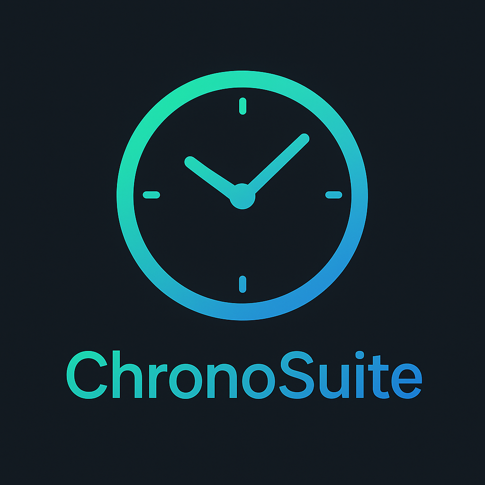

Here's a comprehensive README.md file for your GitHub repository:

# 🕰️ ChronoSuite - A Quantum Time Utility



A beautiful, cross-platform time management app built with Flutter featuring quantum-inspired visuals, glass morphism design, and 10 stunning themes.

## 🌟 Features

- 🕐 **Live Clock** with smooth animations
- ⏱️ **Stopwatch** with start/pause/reset functionality  
- ⏲️ **Timer** with circular countdown progress
- 🎨 **10 Beautiful Themes** with unique visual styles
- 🌊 **Quantum Visual Effects** with animated wave backgrounds
- ✨ **Glass Morphism UI** with backdrop filters
- ⌨️ **Keyboard Shortcuts** for desktop/web
- 📱 **Cross-Platform** - Works on Android, iOS, Web, and macOS
- 🖥️ **Desk Mode** - Floating transparent widget

## 🎨 Themes

1. **Cyberpunk Neon** - Dark tech with cyan/pink accents
2. **Galactic Purple** - Deep space purple theme
3. **Sunset Orange** - Warm sunset gradients  
4. **Arctic Ice** - Cool blue glass theme
5. **Matrix Green** - Classic terminal green
6. **Deep Ocean** - Ocean depth blues
7. **Fire Red** - Intense red fire theme
8. **Golden Hour** - Rich gold and yellow
9. **Electric Pink** - Vibrant pink/cyan combo
10. **Aurora Borealis** - Northern lights colors

## 📸 Demo

### macOS Version


### iOS Version  


### Android Version


### Web Version


## 🚀 Quick Start

### Prerequisites
- Flutter 3.24+
- Dart 3.0+

### Installation

1. **Clone the repository**
```bash
git clone https://github.com/yourusername/chronosuite.git
cd chronosuite
```

2. **Install dependencies**
```bash
flutter pub get
```

3. **Run the app**
```bash
# For web
flutter run -d chrome

# For Android
flutter run -d android

# For iOS (requires Mac)
flutter run -d iPhone

# For macOS (requires Mac)  
flutter run -d macos
```

## 📦 Build Instructions

### Build for Web
```bash
flutter build web --release
```

### Build for Android
```bash
# APK for direct installation
flutter build apk --release

# App Bundle for Play Store
flutter build appbundle --release
```

### Build for iOS (requires Mac)
```bash
flutter build ipa --release
```

### Build for macOS (requires Mac)
```bash
flutter build macos --release
```

## ⌨️ Keyboard Shortcuts

- `Ctrl+T` / `Cmd+T` - Switch themes
- `Ctrl+S` / `Cmd+S` - Start/Stop stopwatch  
- `Ctrl+R` / `Cmd+R` - Reset timer
- `Ctrl+C` / `Cmd+C` - Go to clock screen
- `Ctrl+Q` / `Cmd+Q` - Toggle quantum mode
- `Ctrl+D` / `Cmd+D` - Toggle desk mode

## 🏗️ Project Structure

```
lib/
├── main.dart                 # App entry point
├── app.dart                  # Main app widget
├── models/
│   ├── app_state.dart        # App state management
│   └── theme_model.dart      # Theme data models
├── screens/
│   ├── clock_screen.dart     # Live clock screen
│   ├── stopwatch_screen.dart # Stopwatch functionality
│   └── timer_screen.dart     # Timer functionality
├── widgets/
│   ├── quantum_wave.dart     # Animated wave background
│   ├── glass_button.dart     # Glass morphism buttons
│   ├── theme_switcher.dart   # Theme dropdown
│   ├── floating_particles.dart # Quantum particles
│   └── desk_mode.dart        # Floating desk widget
├── themes/                   # 10 theme files
└── utils/
    ├── keyboard_handler.dart # Keyboard shortcuts
    └── responsive_layout.dart # Responsive design
```

## 🎯 Features in Detail

### Quantum Mode
Toggle quantum mode to enable:
- Animated wave function background
- Floating particle system
- Enhanced visual effects

### Desk Mode  
Mini floating clock widget that stays on top of other applications.

### Responsive Design
Adapts seamlessly to mobile, tablet, desktop, and web layouts.

## 🔧 Configuration

### Adding Custom Themes
Create new theme files in `lib/themes/` following the existing pattern.

### Modifying App Icon
Replace `assets/logo.png` and run:
```bash
flutter pub run flutter_launcher_icons:main
```

## 📱 Platform Support

| Platform | Version | Status |
|----------|---------|--------|
| Android  | 5.0+    | ✅      |
| iOS      | 12.0+   | ✅      |
| Web      | Modern  | ✅      |
| macOS    | 10.14+  | ✅      |

## 🤝 Contributing

1. Fork the project
2. Create your feature branch (`git checkout -b feature/AmazingFeature`)
3. Commit your changes (`git commit -m 'Add some AmazingFeature'`)
4. Push to the branch (`git push origin feature/AmazingFeature`)
5. Open a Pull Request

## 📄 License

This project is licensed under the MIT License - see the [LICENSE](LICENSE) file for details.

## 🙏 Acknowledgments

- Flutter team for the amazing framework
- Material Design for UI inspiration
- Quantum physics for visual inspiration

## 📞 Support

If you have any questions or issues, please open an issue on GitHub.

---

<div align="center">

**ChronoSuite © 2025 — A Quantum Time Utility**

*Made with ❤️ and Flutter*

</div>
